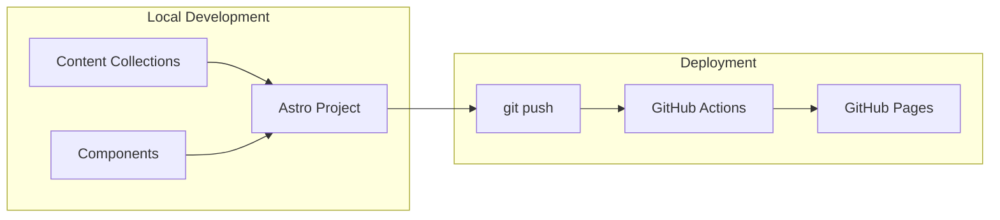

# Astro Portfolio on GitHub Pages

## Architecture



## Stack

- **Framework**: Astro 6.x (ships zero JS by default, islands architecture for interactivity)
- **Styling**: Tailwind CSS 4 (CSS-first configuration via `@theme` directives, no JS config file; integrated via `@tailwindcss/vite`)
- **Animations**: CSS animations + View Transitions API (built into Astro) with `prefers-reduced-motion` support
- **Blog**: Astro Content Collections with `glob()` loader (write posts in Markdown)
- **Hosting**: GitHub Pages (free, auto-deploy via GitHub Actions using `withastro/action@v6`)
- **Domain**: `jerryluoo.github.io/portfolio` (free) or custom domain
- **Images**: Astro `<Image>` component (via `astro:assets`) for automatic optimization

## Project Structure

```
portfolio/
├── src/
│   ├── assets/                 # Optimized images (processed by astro:assets)
│   │   └── profile.jpg
│   ├── components/
│   │   ├── Header.astro        # Navigation bar
│   │   ├── Hero.astro          # Hero / About Me section
│   │   ├── Experience.astro    # Work experience timeline
│   │   ├── Projects.astro      # Project cards grid
│   │   ├── Skills.astro        # Skills with categories
│   │   ├── Education.astro     # Education timeline
│   │   ├── Contact.astro       # Contact form / links
│   │   └── Footer.astro        # Footer with social links
│   ├── content/
│   │   └── blog/               # Markdown blog posts
│   │       └── first-post.md
│   ├── layouts/
│   │   └── BaseLayout.astro    # Shared HTML shell (head, body)
│   ├── pages/
│   │   ├── index.astro         # Main portfolio page
│   │   └── blog/
│   │       ├── index.astro     # Blog listing page
│   │       └── [slug].astro    # Individual blog post
│   ├── styles/
│   │   └── global.css          # Tailwind import + @theme customization
│   └── content.config.ts       # Content collection schemas (glob loader)
├── public/
│   └── favicon.svg
├── .github/
│   └── workflows/
│       └── deploy.yml          # GitHub Actions deploy workflow
├── .gitignore
├── astro.config.mjs
├── tsconfig.json
├── package.json
└── README.md
```

## Key Implementation Details

### 0. Astro Configuration (`astro.config.mjs`)

```javascript
import { defineConfig } from 'astro/config';
import tailwindcss from '@tailwindcss/vite';

export default defineConfig({
  site: 'https://jerryluoo.github.io',
  base: '/portfolio',
  output: 'static',
  vite: {
    plugins: [tailwindcss()],
  },
});
```

### 0b. Tailwind CSS Configuration (`src/styles/global.css`)

No JS config file. All customization via CSS:
```css
@import "tailwindcss";

@theme {
  --color-primary: #3b82f6;
  --color-secondary: #6366f1;
  --font-sans: 'Inter', sans-serif;
}
```

### 0c. Content Collections (`src/content.config.ts`)

```typescript
import { defineCollection, z } from 'astro:content';
import { glob } from 'astro/loaders';

const blog = defineCollection({
  loader: glob({ pattern: '**/*.md', base: './src/content/blog' }),
  schema: z.object({
    title: z.string(),
    pubDate: z.date(),
    description: z.string(),
    tags: z.array(z.string()).optional(),
  }),
});

export const collections = { blog };
```

### 1. GitHub Pages Deployment (free, automatic)

The GitHub Actions workflow (`.github/workflows/deploy.yml`) will:
- Trigger on push to `main`
- Build using `withastro/action@v6` (handles install + build + artifact upload)
- Deploy using `actions/deploy-pages@v4`

```yaml
name: Deploy to GitHub Pages
on:
  push:
    branches: [main]
permissions:
  contents: read
  pages: write
  id-token: write
jobs:
  build:
    runs-on: ubuntu-latest
    steps:
      - uses: actions/checkout@v4
      - uses: withastro/action@v6
  deploy:
    needs: build
    runs-on: ubuntu-latest
    environment:
      name: github-pages
      url: ${{ steps.deployment.outputs.page_url }}
    steps:
      - id: deployment
        uses: actions/deploy-pages@v4
```

### 2. Sections Overview

- **Hero**: Full-viewport intro with name, title, short bio, and a CTA button
- **Experience**: Vertical timeline with company, role, dates, and bullet points
- **Projects**: Responsive card grid with optimized thumbnails (via `<Image>`), descriptions, tech tags, and links. All images require alt text.
- **Skills**: Grouped by category (Languages, Frameworks, Tools) with visual indicators
- **Education**: Timeline similar to experience
- **Contact**: Default is social links (GitHub, LinkedIn, email via `mailto:`). Optional enhancement: add a Formspree form (free tier, 50 submissions/month) — requires user to create a Formspree account and add their endpoint.
- **Blog**: Markdown-powered with Zod-validated frontmatter (title, pubDate, description, tags). Sample post included for reference.

Sample blog post (`src/content/blog/first-post.md`):
```markdown
---
title: "Hello World"
pubDate: 2026-05-19
description: "My first blog post on my new portfolio site."
tags: ["intro", "astro"]
---

Welcome to my blog! This is my first post.
```

### 3. Features Included

- Dark/light mode toggle using Tailwind's `class` strategy (JS toggles `.dark` on `<html>`, with system preference as default)
- Smooth scroll navigation with keyboard-accessible focus management
- View Transitions (page transitions built into Astro)
- Responsive design (mobile-first)
- SEO meta tags and Open Graph
- RSS feed for blog (via `@astrojs/rss` — requires `site` in config)
- Scroll-triggered fade-in animations via CSS `@keyframes` + Intersection Observer, with `prefers-reduced-motion: reduce` support to disable animations for users who opt out

### 3b. Accessibility

- Semantic HTML throughout: `<main>`, `<nav>`, `<section>`, `<article>`, `<header>`, `<footer>`
- All images have descriptive `alt` text
- Color contrast ratios meet WCAG AA (4.5:1 for text)
- Keyboard navigation works for all interactive elements
- ARIA labels on icon-only buttons (dark mode toggle, social links)
- `prefers-reduced-motion` media query disables scroll animations

### 3c. Performance

- Target: Lighthouse 90+ across all four categories (Performance, Accessibility, Best Practices, SEO)
- Use Astro `<Image>` component for automatic image optimization (WebP/AVIF, responsive srcset)
- Zero JS shipped by default; only dark mode toggle requires a small inline script

### 4. Setup Instructions (for the user)

After implementation:
1. Repo already created: `jerryluoo/portfolio`
2. Push the code to `main`
3. Enable GitHub Pages in repo Settings > Pages > Source: GitHub Actions
4. Site will be live at `https://jerryluoo.github.io/portfolio/`

## Cost: Completely Free

- GitHub Pages hosting: free
- GitHub Actions CI/CD: free (2,000 minutes/month)
- Custom domain: optional (free to configure, domain costs money if you buy one)
- Formspree contact form: free tier (50 submissions/month)
